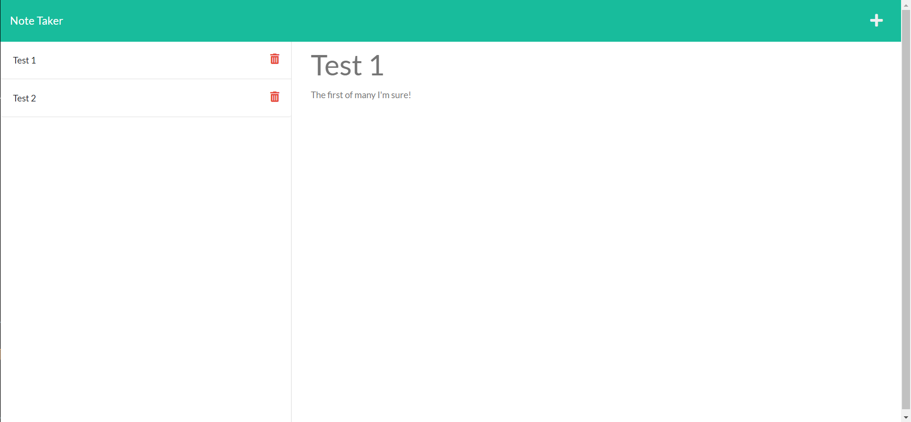

# Thought Organizer

  

## Description

A webpage that allows a user to write and save notes which will persist on a remote server (Heroku).

## Table of Contents
- [Installation](#installation)
- [Usage](#usage)
- [License](#license)
- [Contributing](#contributing)
- [Tests](#tests)
- [Questions](#questions)

## Installation

Run 'npm i' or 'npm install' to install relevent files.

## Usage

Visit the live page at: https://afternoon-badlands-88512.herokuapp.com/

Or if running locally, run 'npm start' in gitbash to start the server then visit http://localhost:3001/

  
## License

[https://choosealicense.com/licenses/mit](https://choosealicense.com/licenses/mit)

A short and simple permissive license with conditions only requiring preservation of copyright and license notices. Licensed works, modifications, and larger works may be distributed under different terms and without source code.
  

## Contributing

I can be contacted through the information provided in the 'Questions' section.

## Tests

'npm start' then visit http://localhost:3001/ in the browser.

Or visit the live page at: https://afternoon-badlands-88512.herokuapp.com/

## Questions

If you have any qestions for me you can reach me here:

Github: https://github.com/vrentadax/
  
Email: vrentadax@outlook.com
